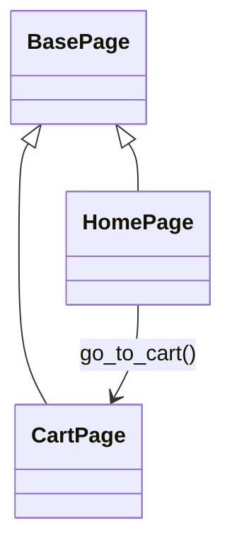
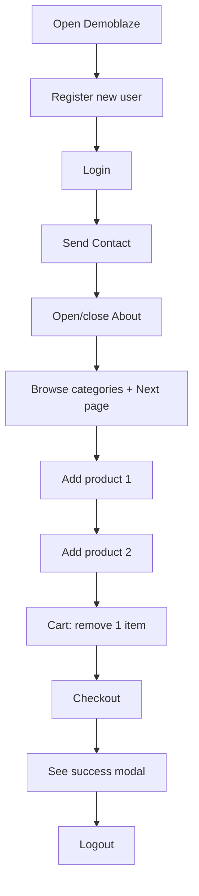

# Demoblaze UI Automation (Selenium + Pytest)

Plain-English guide for new QA contributors.

## What this project does
Automates a few key flows on https://www.demoblaze.com using Selenium WebDriver (Chrome) and Pytest. Page Object Model (POM) keeps locators and actions tidy.

## Quick commands
- Smoke E2E (single browser, full journey):
  ```bash
  pytest -q tests/test_smoke.py
  ```
- Regression set (extra UI/auth/cart cases):
  ```bash
  pytest -q -m regression tests/test_regression.py
  ```
- Everything:
  ```bash
  pytest -q
  ```

## Project layout (only what you need)
```
tests/
  conftest.py          # fixtures: driver (Chrome), fresh_user
  pages/               # Page Objects (BasePage, HomePage, CartPage)
  utils.py             # shared waits/screenshots/helpers
  test_smoke.py        # single-session end-to-end happy path
  test_regression.py   # additional scenarios (marked regression)
.legacy/               # archived old scripts/tests (ignore)
pytest.ini             # markers (smoke, regression, auth, cart, ui), addopts=-q
```

### Tree view
```
.
├── README.md
├── pytest.ini
├── tests
│   ├── conftest.py
│   ├── utils.py
│   ├── pages
│   │   ├── base_page.py
│   │   ├── home_page.py
│   │   └── cart_page.py
│   ├── test_smoke.py
│   └── test_regression.py
└── .legacy/   (archived old scripts/tests)
```

### POM relationships (simple)


### Smoke flow (happy path, one session)


### Flow diagram (smoke test)
```
Start
  ↓
Open demoblaze home
  ↓
Register user
  ↓
Login user
  ↓
Contact message
  ↓
About modal open/close
  ↓
Browse categories + pagination
  ↓
Add two products
  ↓
Cart: remove one item
  ↓
Checkout → success modal
  ↓
Logout
  ↓
End
```

## How the main smoke test works
`tests/test_smoke.py` in one browser/session:
1) Register a new user
2) Login
3) Send contact message
4) Open/close About modal
5) Browse categories + pagination
6) Add two products, remove one in cart
7) Checkout and verify success modal
8) Logout

## Fixtures & data
- Driver: `session_driver` fixture creates a Chrome browser via webdriver-manager.
- User data: generated per run inside the test; defaults live at the top of `test_smoke.py`.
- No external config needed; everything is in-file for clarity.

## Page Objects
- `BasePage`: click, fill, waits, alert handling.
- `HomePage`: open site, signup/login, contact, about, category navigation, add-to-cart, go-to-cart.
- `CartPage`: list rows, totals, delete first row, checkout.

## Running tips
- Internet required (demoblaze.com is online).
- webdriver-manager auto-downloads matching ChromeDriver when Chrome updates.
- If alerts don’t appear, check pop-up blocker.

## Markers you can use
- `smoke` – quick end-to-end
- `regression` – extended coverage
- `auth`, `cart`, `ui` – semantic markers available in pytest.ini

Examples:
```bash
pytest -q -m smoke
pytest -q -m "regression and not ui"
```

## Allure reporting (with screenshots)
- Generate results while running tests (example with smoke):
  ```bash
  pytest -q tests/test_smoke.py --alluredir=allure-results
  ```
  Or full suite:
  ```bash
  pytest -q --alluredir=allure-results
  ```
- View the report (requires Allure CLI, already installed here):
  ```bash
  allure serve allure-results
  ```
  This starts a local server and opens the report in your browser; press Ctrl+C to stop.
- Screenshots are auto-attached at key steps (login, cart, checkout) via `take_screenshot`; the PNG files are stored in `screenshots/` (gitignored).

## Logs, screenshots, artifacts
- Screenshots live in `screenshots/` (gitignored).
- Allure raw results (if enabled) go to `allure-results/` (gitignored).

## If you get stuck
- Re-run smoke first to isolate issues: `pytest -q tests/test_smoke.py`.
- Clear cached drivers if needed: remove `~/.wdm` (optional).
- Ensure Chrome is installed/up to date.

## Contributing guidelines (lightweight)
- Add actions to Page Objects, not directly in tests.
- Keep tests short: arrange steps via POM methods, assert near the action.
- Use existing markers; add new ones in pytest.ini if truly needed.
- Prefer explicit waits in POM/helpers; avoid raw time.sleep.
